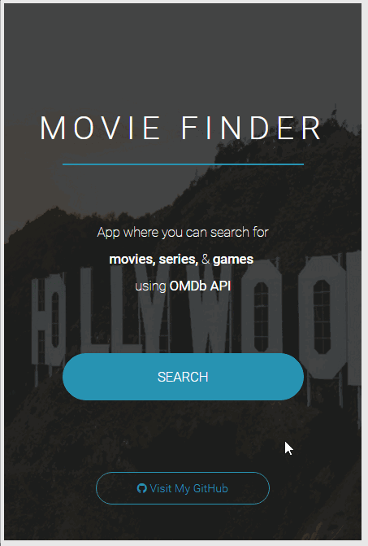

# Movie Finder

#### App where you search for movies, series &amp; games using OMDb API.



*(Learning the Flux architecture)*

## Config

The OMDb API requires a free key for testing that allows a maximum of 1,000 daily requests.

You can get your key [here](http://www.omdbapi.com/apikey.aspx).

After you fill your info you will need to confirm your email and click on a link to activate the key and after that you got your key ready to use.

Now you need to go into ```sh src/js/utils/AppAPI.js``` and add the key in line 5.

## Install

```sh
$ npm install
```

## Usage
```sh
$ gulp
```
```sh
run dist/index.html
```
